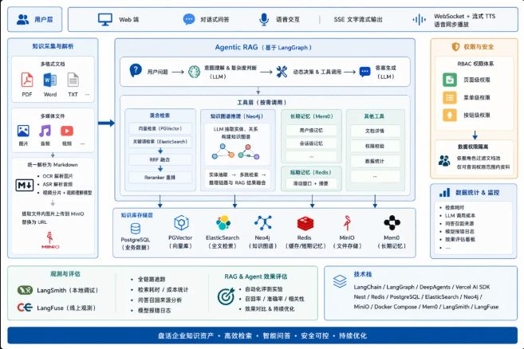
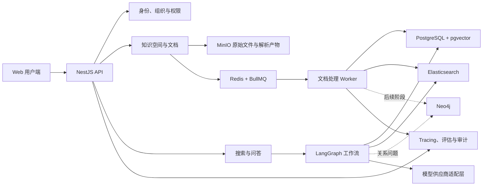
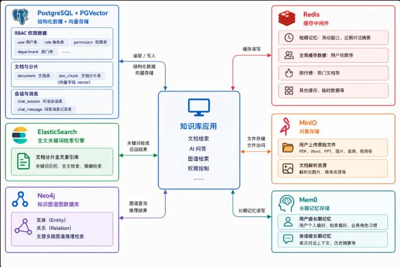
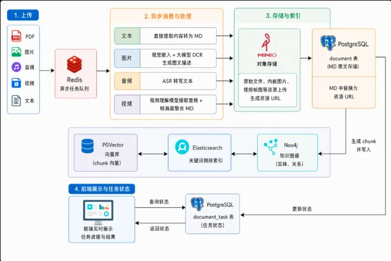
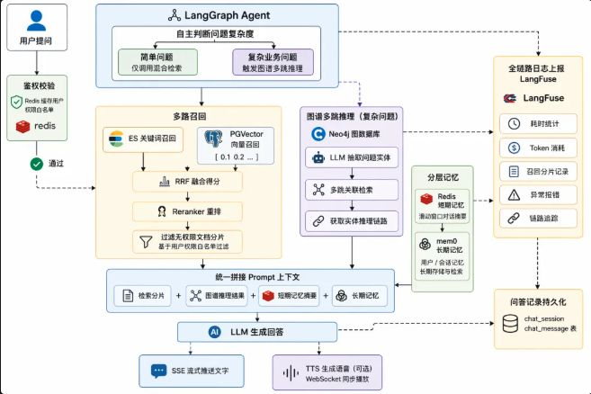
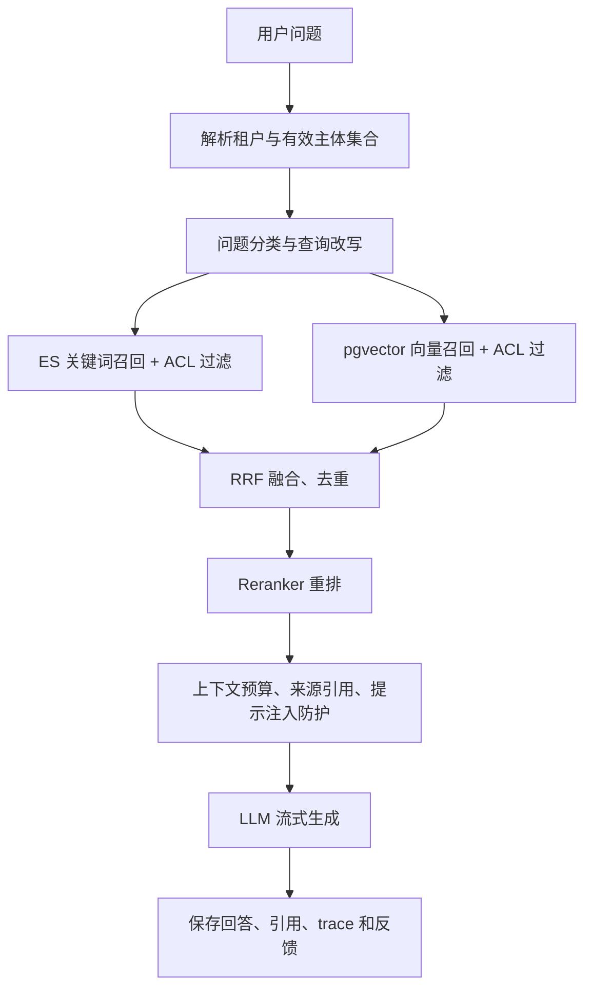

# 企业级知识库项目拆解

> 版本：2026-07-15  
> 参考文章：[企业级知识库项目：项目介绍、多模态 RAG 流程梳理](https://mp.weixin.qq.com/s/6LjtykpTXdqD-uR0kC-krQ)

## 1. 结论

文章描述的是一个完整目标态，不适合一次性实现。建议先做成 **TypeScript 单体仓库 + 模块化单体 API + 独立异步 Worker**，优先交付“带权限过滤、引用溯源和效果评估的文本 RAG 闭环”，再逐步加入多模态、知识图谱、长期记忆和语音交互。

第一版最重要的不是 Agent 自主性，而是以下四件事：

1. 文档可以稳定解析、重试、重建索引。
2. 无权限内容绝不会进入召回结果和 LLM 上下文。
3. 回答能定位到原文、页码或段落，并提供引用。
4. 检索与回答效果可以通过固定数据集重复评估。

## 2. 产品范围

目标用户是企业内部员工、知识管理员和系统管理员。核心工作流如下：

- 管理员创建知识空间、文件夹和成员权限。
- 员工上传文档，后台异步解析并展示阶段进度。
- 用户通过全文搜索或语义搜索查找资料。
- 用户提问后，系统只从其有权访问的文档中召回内容并生成带引用的回答。
- 管理员查看使用量、失败任务、检索质量、模型成本和审计记录。

目标态还包括图片、音频、视频解析，知识图谱，多跳推理，长期记忆，语音输入输出和 Agent 工具调用。这些不应进入首个 MVP。

## 3. 推荐架构





### 3.1 运行单元

| 单元 | 职责 | 建议 |
| --- | --- | --- |
| `web` | 文档管理、搜索、聊天、任务进度、系统管理 | Next.js/React，使用流式响应客户端 |
| `api` | 鉴权、业务 API、权限解析、上传签名、搜索和聊天入口 | NestJS 模块化单体 |
| `worker` | 解析、OCR/ASR、切片、嵌入、索引、图谱抽取 | 独立进程，共享领域包；首版保持 TypeScript |
| 基础设施 | PostgreSQL、Redis、MinIO、Elasticsearch，后续增加 Neo4j | 本地 Docker Compose，生产环境可分别托管 |

推荐单体仓库结构：

```text
apps/
  web/
  api/
  worker/
packages/
  contracts/       # DTO、事件、队列任务协议
  domain/          # 权限、文档、会话等领域规则
  rag/             # 解析、切片、检索、重排、上下文组装
  model-gateway/   # LLM、Embedding、Reranker、OCR、ASR 适配层
  observability/   # trace、metrics、audit
infra/
  compose/
docs/
```

### 3.2 存储边界



- **PostgreSQL 是业务事实源**：租户、用户、权限、文档版本、任务、会话、消息、引用和审计记录都以它为准。
- **MinIO 是文件事实源**：保存原文件、规范化 Markdown、提取图片、音视频切片等不可结构化产物。
- **Elasticsearch 和 pgvector 是可重建的检索投影**：索引损坏时必须能从 PostgreSQL/MinIO 重建。
- **Neo4j 是可重建的关系投影**：实体和关系必须保存来源文档、版本、分片和抽取模型信息。
- **Redis 只存临时状态**：队列、限流、短期缓存和近期会话摘要，不能承载不可恢复的业务事实。
- **Mem0 是后续可选能力**：长期记忆不能替代明确的用户配置或会话记录。

## 4. 领域模块

| 模块 | 主要职责 | MVP |
| --- | --- | --- |
| 身份与组织 | 租户、部门、用户、角色、登录和审计 | 是 |
| 权限中心 | 页面权限、资源 ACL、文件夹继承、检索过滤条件 | 是 |
| 知识空间 | 空间、文件夹、标签、文档、版本、归档 | 是 |
| 文件服务 | 预签名上传、校验、去重、病毒扫描接口、MinIO | 是 |
| 任务中心 | 状态机、BullMQ 任务、重试、取消、死信和进度 | 是 |
| 文档解析 | 文本提取、规范化 Markdown、页码/段落锚点 | 是 |
| 多模态解析 | 图片 OCR/描述、音频 ASR、视频理解 | 后续 |
| 索引中心 | 切片、嵌入、ES/pgvector 写入、重建索引 | 是 |
| 搜索中心 | 关键词/向量召回、RRF、重排、权限下推 | 是 |
| 知识图谱 | 实体关系抽取、消歧、图谱检索、多跳推理 | 后续 |
| 问答编排 | LangGraph、上下文组装、流式回答、引用 | 是 |
| 记忆中心 | 短期摘要、用户/会话长期记忆 | 后续 |
| 评估与观测 | trace、成本、延迟、召回、答案和引用评估 | 是 |

## 5. 数据模型骨架

首版建议至少包含以下关系表：

```text
tenant
department
user
role
permission
user_role

knowledge_space
folder
document
document_version
document_asset
resource_acl

ingestion_job
ingestion_stage
outbox_event
document_chunk

chat_session
chat_message
chat_run
chat_citation

evaluation_dataset
evaluation_case
evaluation_run
audit_log
```

关键约束：

- `document` 表示逻辑文档，实际内容放在不可变的 `document_version` 中。
- `document_chunk` 必须关联版本，保存页码、段落、时间戳等来源锚点。
- 所有业务表和检索索引都带 `tenant_id`，禁止依赖应用层补过滤。
- ACL 可以授予用户、角色或部门；文件夹继承后的有效权限应可物化并增量刷新。
- ES 和向量索引至少包含 `tenant_id`、`document_id`、`version_id`、`allowed_principal_ids`、`status`，权限条件直接下推到召回查询。
- 索引写入通过 Outbox/任务状态推进，避免数据库成功但搜索索引失败的永久不一致。

## 6. 文档处理链路



推荐状态机：

```text
RECEIVED -> STORED -> PARSING -> NORMALIZING -> CHUNKING
         -> ENRICHING -> INDEXING -> READY
```

任一阶段可进入 `RETRYING`、`FAILED` 或 `CANCELLED`。每个阶段必须幂等，并记录输入校验和、处理器版本、模型版本、开始/结束时间和错误原因。

处理步骤：

1. API 创建文档版本和上传凭证，客户端直传 MinIO。
2. 上传完成后校验大小、类型和 SHA-256，提交 BullMQ 任务。
3. Worker 提取正文和资源，生成带来源锚点的规范化 Markdown。
4. 按标题、段落和长度进行结构化切片，保留必要重叠，避免跨权限或跨表格边界混切。
5. 批量生成 Embedding，并同时写入 pgvector 与 Elasticsearch。
6. 所有检索投影成功后才把版本切换为 `READY`；失败时旧版本继续提供服务。
7. 后续阶段再并行执行图片理解、ASR、视频解析和图谱抽取。

首版文件类型建议只做 PDF、DOCX、TXT、Markdown、HTML。PPTX/XLSX 的结构化抽取、扫描 PDF、图片、音频和视频分别作为独立增量，不要用一个“万能解析器”同时上线。

## 7. 安全检索与问答链路





必须纠正文章中的一个高风险描述：**不能先召回所有文档，再在应用层过滤无权限分片。** 权限条件必须下推到 ES 和向量查询，重排和 LLM 上下文只能接触已授权内容。应用层可以再做一次防御性校验，但不能把它当作唯一防线。

首版使用确定性 LangGraph 工作流，而不是让 Agent 任意决定所有步骤：

- 普通问答固定执行权限解析、混合召回、融合、重排、上下文组装、生成和落库。
- 只有明确的关系型复杂问题才进入知识图谱分支。
- 工具调用必须有白名单、参数校验、超时、预算和审计。
- 文档内容视为不可信输入，不能执行文档中的指令或泄露系统提示词。
- 答案没有充分证据时应明确拒答，不能靠长期记忆补事实。

LangGraph 当前 JavaScript 文档支持持久化执行、流式输出和人工介入，适合作为有状态工作流编排器；它不应替代权限、文档和任务等业务领域模块。NestJS 官方当前推荐 `@nestjs/bullmq` 对接 Redis 队列，BullMQ 仍处于活跃开发状态。

## 8. 交付阶段

### M0：工程基础

- 初始化 pnpm 单体仓库、代码规范、环境配置和 CI。
- Docker Compose 启动 PostgreSQL/pgvector、Redis、MinIO、Elasticsearch。
- 建立迁移、种子数据、日志、trace、健康检查和 Testcontainers 测试基座。

### M1：身份、权限与文档管理

- 用户、部门、角色、权限、知识空间和文件夹。
- 文档上传、版本管理、ACL 继承、任务列表和审计日志。
- 完成 MinIO 直传和 BullMQ 空任务闭环。

### M2：文本解析与索引

- 支持 PDF、DOCX、TXT、Markdown、HTML。
- 完成规范化 Markdown、来源锚点、结构化切片和 Embedding。
- 建立 ES 与 pgvector 索引、幂等重试和全量重建能力。

### M3：安全混合检索与问答

- ES + pgvector 并行召回、RRF 融合、Reranker 重排。
- ACL 下推、引用溯源、SSE 流式回答、会话持久化和用户反馈。
- 用 LangGraph 实现确定性 RAG 工作流。

### M4：MVP 生产化

- 固定评估集、Recall@K/nDCG、引用准确率和回答忠实度评估。
- 限流、配额、取消、超时、重试、模型成本和延迟看板。
- 权限泄露测试、提示注入测试、备份恢复和索引重建演练。

完成 M4 后才算首个可用版本。

### M5：多模态

- 图片 OCR 与描述、图文互搜。
- 音频 ASR 与时间戳引用。
- 视频分段、关键帧、音轨转写和跨模态向量。

### M6：知识图谱与高级 Agent

- 实体/关系 schema、抽取、消歧、证据溯源、Neo4j 投影。
- 仅对关系型问题触发多跳检索，并与文本 RAG 融合。
- 长期记忆、人工介入、受控工具调用、语音输入和流式 TTS。

## 9. MVP 验收标准

- 不同租户、部门、角色之间的越权召回数为 0。
- 文档重复提交、任务重试和 Worker 重启不会生成重复版本或重复分片。
- 新版本索引失败时，线上仍使用上一个 `READY` 版本。
- 每条回答至少能返回文档名、版本和页码/段落锚点；点击引用可定位原文。
- 固定评估集能输出关键词、向量、融合、重排各阶段指标，而不仅是最终主观评分。
- 任意 ES、向量或 Neo4j 投影都能从 PostgreSQL/MinIO 重建。
- 模型调用有超时、取消、重试上限、Token 预算和可追踪的成本记录。

## 10. 主要风险

1. **权限泄露**：召回后过滤过晚、缓存键缺少租户、引用接口未复验权限。
2. **解析质量**：PDF 表格、双栏排版、扫描件、PPT 和 Excel 不能共用简单纯文本策略。
3. **索引一致性**：多存储双写失败、删除未同步、文档版本切换不原子。
4. **模型升级**：Embedding 维度或模型变化需要双索引迁移，不能原地覆盖。
5. **图谱幻觉**：抽取关系必须保留证据，低置信度关系不能直接用于回答。
6. **提示注入**：文档正文、网页抓取结果和工具输出都要作为不可信数据隔离。
7. **效果不可测**：没有固定问题集和相关性标注时，很难判断 RAG 改动是提升还是退化。

## 11. 下一步实现顺序

1. 确认模型供应商、部署目标和首批文档类型。
2. 初始化 monorepo 与本地基础设施。
3. 设计数据库迁移、事件协议和任务状态机。
4. 先完成“上传一个 TXT/Markdown -> 异步处理 -> 搜索到原文”的纵向切片。
5. 再接 PDF/DOCX、向量检索、混合融合、重排和聊天。
6. 最后补齐权限压力测试、评估集和生产保护，再进入多模态阶段。

## 12. 技术依据

- [LangGraph JavaScript 概览](https://docs.langchain.com/oss/javascript/langgraph/overview)
- [LangGraph 工作流与 Agent](https://docs.langchain.com/oss/javascript/langgraph/workflows-agents)
- [NestJS 队列文档](https://docs.nestjs.com/techniques/queues)
