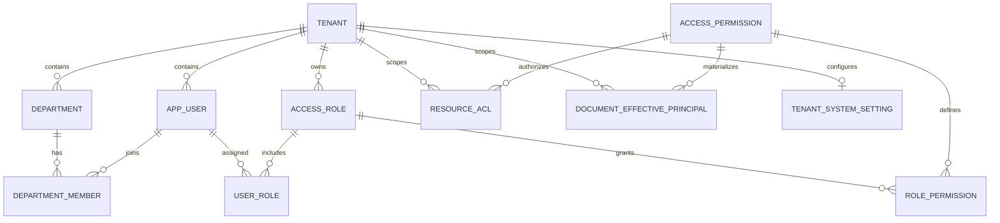
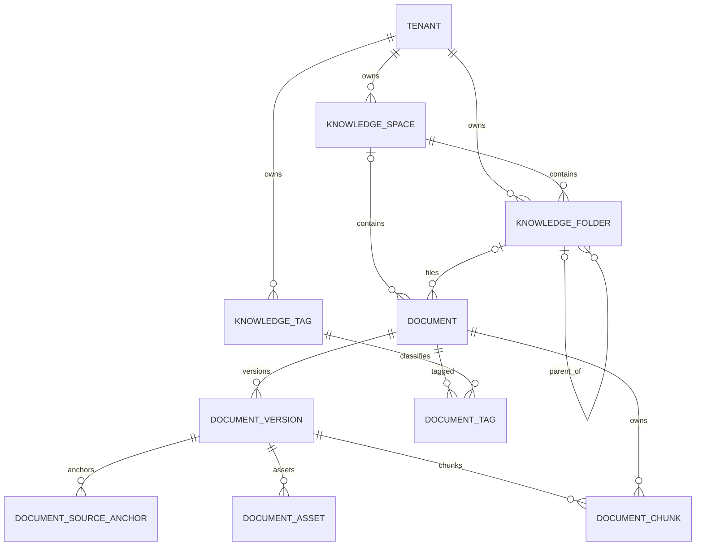
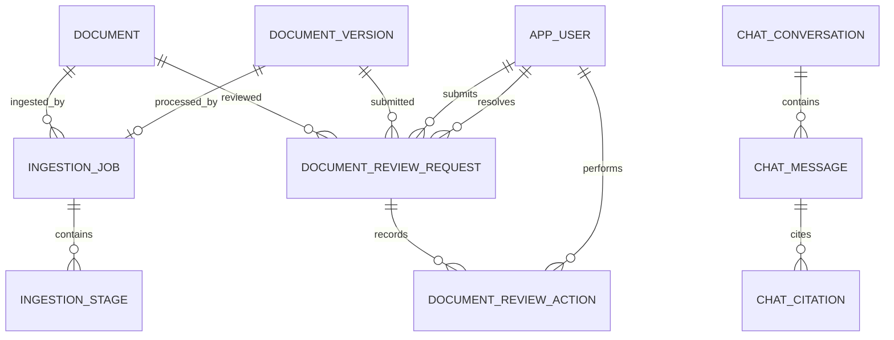
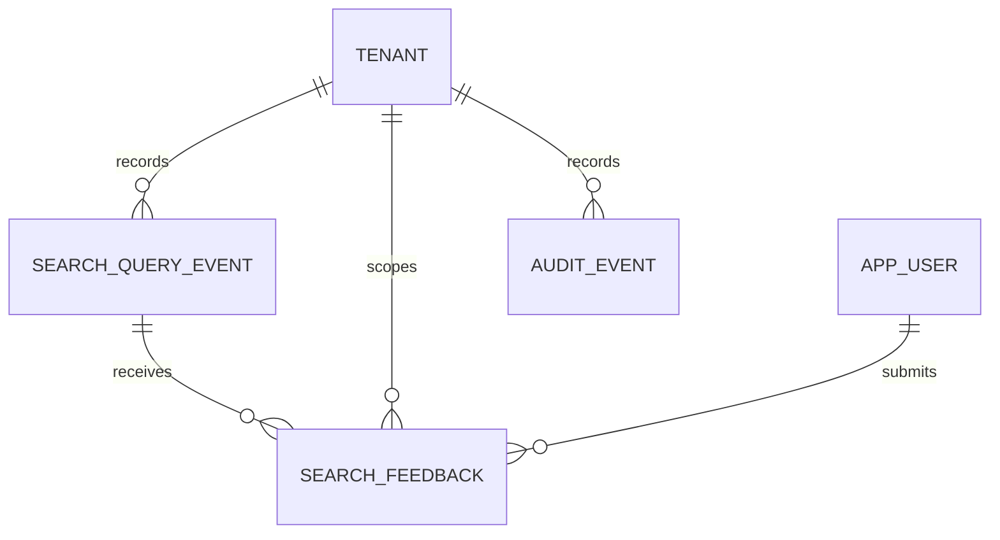

# PostgreSQL 表结构与关系

更新时间：2026-09-03

## 1. 当前基线

- 数据库：PostgreSQL 16（`pgvector/pgvector:pg16`）
- ORM：TypeORM 0.3.27
- Schema：`public`
- 已启用扩展：`vector 0.8.5`、`pgcrypto 1.3`、`plpgsql 1.0`
- 业务表：31 张
- 元数据表：1 张 TypeORM `migrations`
- 已执行迁移：11/11，最新为 `PermissionHardening1754611200000`
- 向量字段：`document_chunk.embedding vector(384)`
- Schema 管理：`synchronize: false`，以迁移文件为准

本文件依据以下三处交叉核对：

1. `packages/database/src/entities.ts`
2. `packages/database/src/migrations/*.ts`
3. 本地运行中的 PostgreSQL `information_schema`、`pg_constraint`、`pg_indexes`

字段标记约定：

- `PK`：主键
- `FK`：数据库外键
- `UQ`：唯一约束或唯一索引
- `?`：允许 `NULL`
- 未特别注明的 `id` 均为 `uuid`，由应用生成

## 2. 业务域总览

| 业务域          | 表                                                                                                                 |
| --------------- | ------------------------------------------------------------------------------------------------------------------ |
| 租户与身份      | `tenant`、`app_user`、`department`、`department_member`                                                            |
| RBAC 与资源 ACL | `access_role`、`access_permission`、`user_role`、`role_permission`、`resource_acl`、`document_effective_principal` |
| 知识组织        | `knowledge_space`、`knowledge_folder`、`knowledge_tag`、`document_tag`                                             |
| 文档与版本      | `document`、`document_version`、`document_source_anchor`、`document_asset`、`document_chunk`                       |
| 文档审核        | `document_review_request`、`document_review_action`                                                                |
| 文档摄取        | `ingestion_job`、`ingestion_stage`、`outbox_event`                                                                 |
| RAG 会话        | `chat_conversation`、`chat_message`、`answer_run`、`chat_citation`                                                 |
| 检索与治理      | `search_query_event`、`search_feedback`、`tenant_system_setting`、`audit_event`                                    |

`tenant_id` 是主要的数据隔离字段，但并非每张含 `tenant_id` 的表都建立了数据库外键，详见第 7 节。

## 3. 实体关系

### 3.1 租户、用户与权限

权限模型分两层：

1. `access_role` + `role_permission` 表示租户级 RBAC。
2. `resource_acl` 保存文档、空间或文件夹上的原始授权；`document_effective_principal` 保存展开继承后的文档读取主体，用于检索过滤。

`resource_acl.resource_id/principal_id` 和
`document_effective_principal.source_resource_id` 是多态引用，不使用物理外键。

### 3.2 知识组织、文档与版本

`document.current_ready_version_id` 反向指向当前可用的
`document_version.id`，因此 `document` 与 `document_version` 之间存在：

- 一对多版本关系：`document_version.document_id -> document.id`
- 零或一条当前版本关系：`document.current_ready_version_id -> document_version.id`

### 3.3 摄取、审核与会话

`chat_citation` 中的 `chunk_id`、`document_id`、`document_version_id`
是引用快照字段，目前只有 `message_id` 建立了物理外键。

### 3.4 检索、反馈与审计

`outbox_event` 通过 `aggregate_type + aggregate_id` 逻辑关联业务聚合，
用于数据库事务提交后的异步事件投递，不建立聚合外键。

## 4. 表结构

### 4.1 租户与身份

#### `tenant`

- 用途：多租户根实体。
- 主键：`id`
- 字段：`id uuid PK`、`name varchar(255)`、`status varchar(32)`、
  `created_at timestamptz`、`updated_at timestamptz`
- 约束：`status IN ('active', 'inactive')`

#### `app_user`

- 用途：租户内用户。
- 主键：`id`
- 外键：`tenant_id -> tenant.id ON DELETE CASCADE`
- 字段：`id`、`tenant_id`、`display_name varchar(255)`、
  `email varchar(320)?`、`status varchar(32)`、`created_at`、`updated_at`
- 索引：`(tenant_id, display_name)`

#### `department`

- 用途：租户内部门。
- 主键：`id`
- 外键：`tenant_id -> tenant.id ON DELETE CASCADE`
- 字段：`id`、`tenant_id`、`name varchar(255)`、`description text?`、
  `created_at`、`updated_at`
- 唯一：`(tenant_id, name)`

#### `department_member`

- 用途：用户与部门的多对多关联。
- 主键：`(department_id, user_id)`
- 外键：`department_id -> department.id`、`user_id -> app_user.id`、
  `tenant_id -> tenant.id`，均为 `ON DELETE CASCADE`
- 字段：`department_id`、`user_id`、`tenant_id`、`created_at`
- 索引：`(tenant_id, user_id)`

### 4.2 权限与 ACL

#### `access_role`

- 用途：租户角色。
- 主键：`id`
- 外键：`tenant_id -> tenant.id ON DELETE CASCADE`
- 字段：`id`、`tenant_id`、`name varchar(128)`、`description text?`、
  `is_system boolean`、`created_at`、`updated_at`
- 唯一：`(tenant_id, name)`

#### `access_permission`

- 用途：全局权限字典。
- 主键：`key varchar(128)`
- 字段：`key`、`name varchar(255)`、`description text`、
  `scope varchar(16)`
- 约束：`scope IN ('tenant', 'resource')`
- 当前权限包括访问控制、文档 CRUD/管理/分享/审核和知识组织管理。

#### `user_role`

- 用途：用户与角色的多对多关联。
- 主键：`(user_id, role_id)`
- 外键：`user_id -> app_user.id`、`role_id -> access_role.id`、
  `tenant_id -> tenant.id`，均为 `ON DELETE CASCADE`
- 字段：`user_id`、`role_id`、`tenant_id`、`created_at`
- 索引：`(tenant_id, role_id)`

#### `role_permission`

- 用途：角色与权限的多对多关联。
- 主键：`(role_id, permission_key)`
- 外键：`role_id -> access_role.id`、
  `permission_key -> access_permission.key`，均为 `ON DELETE CASCADE`
- 约束：只能绑定 `scope = 'tenant'` 的权限。

#### `resource_acl`

- 用途：资源上的原始 ACL 授权。
- 主键：`id`
- 外键：`tenant_id -> tenant.id ON DELETE CASCADE`、
  `permission -> access_permission.key`
- 字段：`id`、`tenant_id`、`resource_type varchar(32)`、
  `resource_id uuid`、`principal_type varchar(32)`、
  `principal_id varchar(128)`、`permission varchar(128)`、
  `created_by uuid?`、`created_at`
- 唯一：`(tenant_id, resource_type, resource_id, principal_id, permission)`
- 枚举约束：
  - `resource_type`: `document | space | folder`
  - `principal_type`: `tenant | user | department | role`
- 约束：只能绑定 `scope = 'resource'` 的权限；`principal_id` 前缀必须与
  `principal_type` 一致。

#### `document_effective_principal`

- 用途：物化后的文档有效读取主体，用于 PostgreSQL/Elasticsearch ACL 投影。
- 主键：`id`
- 外键：`tenant_id -> tenant.id ON DELETE CASCADE`、
  `document_id -> document.id ON DELETE CASCADE`、
  `permission -> access_permission.key`
- 字段：`id`、`tenant_id`、`document_id`、
  `principal_id varchar(128)`、`permission varchar(128)`、
  `source_resource_type varchar(32)`、`source_resource_id uuid`、`created_at`
- 唯一：`(tenant_id, document_id, principal_id, permission)`
- 约束：`permission = 'documents.read'`；
  `source_resource_type IN ('document', 'space', 'folder')`

### 4.3 知识组织

#### `knowledge_space`

- 用途：租户内知识空间。
- 主键：`id`
- 外键：`tenant_id -> tenant.id ON DELETE CASCADE`
- 字段：`id`、`tenant_id`、`name varchar(255)`、`description text?`、
  `created_by uuid?`、`created_at`、`updated_at`
- 唯一：`(tenant_id, id)`；`(tenant_id, lower(name))`

#### `knowledge_folder`

- 用途：知识空间内的树形文件夹。
- 主键：`id`
- 外键：
  - `(tenant_id, space_id) -> knowledge_space(tenant_id, id) ON DELETE CASCADE`
  - `parent_id -> knowledge_folder.id`
  - `tenant_id -> tenant.id ON DELETE CASCADE`
- 字段：`id`、`tenant_id`、`space_id`、`parent_id?`、
  `name varchar(255)`、`description text?`、`sort_order integer`、
  `created_by uuid?`、`created_at`、`updated_at`
- 唯一：
  - 根目录：`(tenant_id, space_id, lower(name)) WHERE parent_id IS NULL`
  - 子目录：`(tenant_id, space_id, parent_id, lower(name)) WHERE parent_id IS NOT NULL`
- 约束：`parent_id IS NULL OR parent_id <> id`

#### `knowledge_tag`

- 用途：租户内文档标签。
- 主键：`id`
- 外键：`tenant_id -> tenant.id ON DELETE CASCADE`
- 字段：`id`、`tenant_id`、`name varchar(80)`、`color char(7)`、
  `description text?`、`created_by uuid?`、`created_at`、`updated_at`
- 唯一：`(tenant_id, lower(name))`
- 约束：`color` 必须是 `#RRGGBB`

#### `document_tag`

- 用途：文档与标签的多对多关联。
- 主键：`(document_id, tag_id)`
- 外键：`document_id -> document.id`、`tag_id -> knowledge_tag.id`、
  `tenant_id -> tenant.id`，均为 `ON DELETE CASCADE`
- 字段：`document_id`、`tag_id`、`tenant_id`、`created_at`
- 索引：`(tenant_id, tag_id)`

### 4.4 文档、版本与检索分片

#### `document`

- 用途：文档主记录和生命周期状态。
- 主键：`id`
- 外键：
  - `current_ready_version_id -> document_version.id`
  - `(tenant_id, space_id) -> knowledge_space(tenant_id, id)`
  - `(tenant_id, space_id, folder_id) -> knowledge_folder(tenant_id, space_id, id)`
- 字段：`id`、`tenant_id`、`space_id?`、`folder_id?`、
  `title varchar(500)`、`summary text?`、`status varchar(32)`、
  `current_ready_version_id?`、`created_by?`、`updated_by?`、
  `created_at`、`updated_at`、`deleted_at?`、`purged_at?`、
  `access_principal_ids varchar[]`、`acl_version integer`、
  `search_projection_version integer`
- 约束：`status IN ('draft', 'published', 'archived')`；
  有 `folder_id` 时必须有 `space_id`
- 索引：`(tenant_id, created_at DESC)`

#### `document_version`

- 用途：不可变的文档源文件、解析结果和摄取状态。
- 主键：`id`
- 外键：`document_id -> document.id`
- 字段：
  `id`、`tenant_id`、`document_id`、`version_no integer`、
  `source_bucket varchar(255)`、`source_object_key text`、
  `source_filename varchar(1024)`、`mime_type varchar(255)`、
  `size_bytes bigint`、`sha256 char(64)`、`markdown_bucket varchar(255)?`、
  `markdown_object_key text?`、`parser_name varchar(128)?`、
  `parser_version varchar(64)?`、`ingestion_status varchar(32)`、
  `word_count integer`、`error_code varchar(128)?`、`error_message text?`、
  `created_at`、`ready_at?`
- 唯一：`(tenant_id, document_id, version_no)`
- 状态：`received | stored | parsing | normalizing | chunking | indexing |
ready | retrying | failed | cancelled`

#### `document_source_anchor`

- 用途：解析后 Markdown 区间到原始页、幻灯片或表格行的映射。
- 主键：`id`
- 外键：`document_version_id -> document_version.id ON DELETE CASCADE`
- 字段：`id`、`tenant_id`、`document_version_id`、
  `anchor_type varchar(32)`、`page_no?`、`slide_no?`、
  `sheet_name varchar(255)?`、`row_start?`、`row_end?`、`heading text?`、
  `markdown_offset_start integer`、`markdown_offset_end integer`
- 索引：`(tenant_id, document_version_id)`

#### `document_asset`

- 用途：解析产生的图片等衍生资产元数据；文件本体存储在 MinIO。
- 主键：`id`
- 外键：`document_version_id -> document_version.id ON DELETE CASCADE`
- 字段：`id`、`tenant_id`、`document_version_id`、`kind varchar(32)`、
  `filename varchar(1024)`、`object_key text`、`mime_type varchar(255)`、
  `size_bytes bigint`、`sha256 char(64)`、`page_no integer?`、
  `ordinal integer`、`created_at`
- 唯一：`(document_version_id, object_key)`

#### `document_chunk`

- 用途：RAG 检索分片、源定位、ACL 快照和向量。
- 主键：`id`
- 外键：`document_id -> document.id`；
  `document_version_id -> document_version.id ON DELETE CASCADE`
- 字段：
  `id`、`tenant_id`、`document_id`、`document_version_id`、
  `ordinal integer`、`content text`、`content_sha256 char(64)`、
  `token_count integer`、`anchor_type varchar(32)`、`page_no?`、
  `slide_no?`、`sheet_name varchar(255)?`、`row_start?`、`row_end?`、
  `heading text?`、`markdown_offset_start integer`、
  `markdown_offset_end integer`、`principal_ids varchar[]`、
  `embedding vector(384)`、`embedding_model varchar(128)`、
  `chunker_version varchar(64)`、`created_at`
- 唯一：`(document_version_id, ordinal)`
- 专用索引：
  - GIN：`principal_ids`
  - HNSW：`embedding vector_cosine_ops`
  - B-tree：`(tenant_id, document_version_id)`

### 4.5 文档审核

#### `document_review_request`

- 用途：文档版本的发布审核请求。
- 主键：`id`
- 外键：
  - `tenant_id -> tenant.id ON DELETE CASCADE`
  - `document_id -> document.id ON DELETE CASCADE`
  - `document_version_id -> document_version.id ON DELETE CASCADE`
  - `submitted_by/resolved_by -> app_user.id`
- 字段：`id`、`tenant_id`、`document_id`、`document_version_id`、
  `status varchar(32)`、`submitted_by`、`submitted_at`、`resolved_by?`、
  `resolved_at?`、`decision_comment text?`、`created_at`、`updated_at`
- 状态：`pending | approved | rejected | withdrawn`
- 约束：`pending` 时解决人和解决时间必须为空；其他状态必须同时存在。
- 唯一：同一租户的同一文档最多一个 `pending` 请求。

#### `document_review_action`

- 用途：审核动作的追加式历史记录。
- 主键：`id`
- 外键：`tenant_id -> tenant.id ON DELETE CASCADE`、
  `review_request_id -> document_review_request.id ON DELETE CASCADE`、
  `actor_id -> app_user.id`
- 字段：`id`、`tenant_id`、`review_request_id`、
  `action varchar(32)`、`actor_id`、`comment text?`、`created_at`
- 动作：`submitted | approved | rejected | withdrawn`

### 4.6 文档摄取与事件

#### `ingestion_job`

- 用途：每个文档版本的异步摄取任务。
- 主键：`id`
- 外键：`document_id -> document.id`；
  `document_version_id -> document_version.id`
- 字段：`id`、`tenant_id`、`document_id`、`document_version_id`、
  `status varchar(32)`、`progress integer`、`attempts integer`、
  `generation integer`、`max_attempts integer`、`queue_job_id varchar(255)?`、
  `error_message text?`、`created_at`、`updated_at`、`completed_at?`、
  `cancellation_requested_at?`、`dead_lettered_at?`
- 唯一：`document_version_id`
- 状态：`queued | active | completed | failed | cancelled`
- 约束：`progress BETWEEN 0 AND 100`

#### `ingestion_stage`

- 用途：摄取任务各阶段的执行状态和幂等校验。
- 主键：`id`
- 外键：`job_id -> ingestion_job.id ON DELETE CASCADE`
- 字段：`id`、`job_id`、`stage varchar(32)`、`status varchar(32)`、
  `progress integer`、`processor_version varchar(64)?`、
  `input_checksum char(64)?`、`output_checksum char(64)?`、
  `run_count integer`、`error_message text?`、`started_at`、`completed_at?`
- 唯一：`(job_id, stage)`
- 状态：`active | completed | failed | skipped | cancelled`

#### `outbox_event`

- 用途：事务 Outbox，可靠投递文档摄取、ACL 和搜索投影事件。
- 主键：`id`
- 字段：`id`、`tenant_id`、`aggregate_type varchar(64)`、
  `aggregate_id uuid`、`event_type varchar(128)`、
  `deduplication_key varchar(255)`、`payload jsonb`、
  `status varchar(32)`、`attempts integer`、`next_attempt_at`、
  `locked_at?`、`published_at?`、`last_error text?`、`created_at`、`updated_at`
- 唯一：`deduplication_key`
- 状态：`pending | processing | published | cancelled | dead`
- 调度索引：`(status, next_attempt_at)`

### 4.7 RAG 会话与引用

#### `chat_conversation`

- 用途：用户的问答会话。
- 主键：`id`
- 字段：`id`、`tenant_id`、`created_by uuid`、
  `title varchar(255)`、`created_at`、`updated_at`
- 索引：`(tenant_id, created_by, updated_at DESC)`

#### `chat_message`

- 用途：会话消息。
- 主键：`id`
- 外键：`conversation_id -> chat_conversation.id ON DELETE CASCADE`
- 字段：`id`、`tenant_id`、`conversation_id`、`role varchar(16)`、
  `content text`、`model varchar(128)?`、`created_at`
- 约束：`role IN ('user', 'assistant')`

#### `chat_citation`

- 用途：回答消息对应的文档引用快照。
- 主键：`id`
- 外键：`message_id -> chat_message.id ON DELETE CASCADE`
- 字段：`id`、`tenant_id`、`message_id`、`ordinal integer`、
  `chunk_id`、`document_id`、`document_version_id`、
  `document_title varchar(500)`、`excerpt text`、`source jsonb`、`created_at`
- 唯一：`(message_id, ordinal)`

#### `answer_run`

- 用途：记录一次用户问题对应的检索与回答生成生命周期。
- 主键：`id`
- 外键：`conversation_id -> chat_conversation.id ON DELETE CASCADE`；
  `user_message_id -> chat_message.id ON DELETE CASCADE`；
  `assistant_message_id -> chat_message.id`
- 字段：`id`、`tenant_id`、`conversation_id`、`user_message_id`、
  `assistant_message_id uuid?`、`status varchar(16)`、`error_code varchar(128)?`、
  `started_at`、`completed_at?`
- 唯一：`user_message_id`、`assistant_message_id`
- 状态：`running | completed | failed | cancelled`
- 生命周期约束：`running` 不得有关联回答或完成时间；`completed` 必须关联回答并记录完成时间；
  `failed/cancelled` 不得关联回答且必须记录完成时间；服务层会同时写入错误码。
- 索引：`(tenant_id, conversation_id, started_at)`、`(tenant_id, status, started_at)`

### 4.8 检索与系统治理

#### `search_query_event`

- 用途：搜索和问答检索的观测事件。
- 主键：`id`
- 外键：`tenant_id -> tenant.id ON DELETE CASCADE`
- 字段：`id`、`tenant_id`、`user_id uuid?`、`source varchar(16)`、
  `query_text varchar(2000)`、`filters jsonb`、`result_count integer`、
  `duration_ms integer`、`vector_candidate_count integer`、
  `keyword_candidate_count integer`、`status varchar(16)`、
  `error_code varchar(128)?`、`created_at`
- 约束：计数字段非负；`source IN ('search', 'answer')`；
  `status IN ('success', 'failed')`
- 专用索引：零结果部分索引、大小写无关查询词索引、租户时间索引。

#### `search_feedback`

- 用途：用户对搜索结果的反馈。
- 主键：`id`
- 外键：`tenant_id -> tenant.id`、`query_event_id -> search_query_event.id`、
  `user_id -> app_user.id`，均为 `ON DELETE CASCADE`
- 字段：`id`、`tenant_id`、`query_event_id`、`user_id`、
  `rating varchar(16)`、`reason varchar(32)?`、`comment text?`、
  `created_at`、`updated_at`
- 唯一：`(tenant_id, query_event_id, user_id)`
- 约束：
  - `rating`: `helpful | unhelpful`
  - `reason`: `irrelevant | incomplete | outdated | incorrect | other`
  - `comment` 最长 1000 字符

#### `tenant_system_setting`

- 用途：每租户一份搜索、反馈和审计配置。
- 主键及外键：`tenant_id -> tenant.id ON DELETE CASCADE`
- 字段：`tenant_id`、`search_candidate_limit integer`、
  `search_score_threshold float8`、`search_page_size integer`、
  `feedback_enabled boolean`、`audit_retention_days integer`、
  `version integer`、`updated_by uuid?`、`created_at`、`updated_at`
- 范围约束：
  - `search_candidate_limit`: 50-500
  - `search_score_threshold`: 0-1
  - `search_page_size`: 5-50
  - `audit_retention_days`: 30-3650
  - `version > 0`

#### `model_usage_event`

- 用途：持久记录 API 和 Worker 的每次模型调用尝试，用于租户时间窗口统计、重试计费和预算审计。
- 主键：`id`
- 唯一：`(call_id, attempt)`
- 字段：`call_id`、`tenant_id uuid?`、`user_id uuid?`、`run_id uuid?`、
  `source varchar(32)?`、`operation varchar(16)`、`model varchar(128)`、
  `attempt integer`、`call_status varchar(16)`、`attempt_status varchar(16)`、
  `usage_source varchar(16)`、`reserved_tokens integer`、`input_tokens integer`、
  `output_tokens integer`、`total_tokens integer`、`estimated_cost_usd numeric(20,10)`、
  `attempt_duration_ms integer`、`call_duration_ms integer`、
  `first_token_duration_ms integer?`、`error_code varchar(128)?`、`created_at`
- `usage_source`：
  - `provider`：供应商返回的实际 usage。
  - `estimated`：成功调用未返回 usage 时的估算。
  - `reserved`：失败或超时调用保留的预留 Token。

#### `audit_event`

- 用途：租户内业务审计事件。
- 主键：`id`
- 外键：`tenant_id -> tenant.id ON DELETE CASCADE`
- 字段：`id`、`tenant_id`、`actor_id uuid?`、
  `action varchar(128)`、`resource_type varchar(64)`、`resource_id uuid?`、
  `metadata jsonb`、`created_at`
- 索引：`(tenant_id, created_at DESC)`、
  `(tenant_id, resource_type, resource_id)`

### 4.9 TypeORM 元数据

#### `migrations`

- 用途：记录 TypeORM 已执行的迁移，不承载业务数据。
- 主键：`id integer`
- 字段：`id integer`、`timestamp bigint`、`name varchar`

## 5. 关键关系与删除规则

| 父表                                   | 子表                                              | 关系       | 删除行为         |
| -------------------------------------- | ------------------------------------------------- | ---------- | ---------------- |
| `tenant`                               | 用户、部门、角色、知识组织、ACL、审核、检索治理等 | 1:N        | 大多 `CASCADE`   |
| `department` / `app_user`              | `department_member`                               | N:M        | `CASCADE`        |
| `app_user` / `access_role`             | `user_role`                                       | N:M        | `CASCADE`        |
| `access_role` / `access_permission`    | `role_permission`                                 | N:M        | `CASCADE`        |
| `knowledge_space`                      | `knowledge_folder`                                | 1:N        | `CASCADE`        |
| `knowledge_folder`                     | 子文件夹                                          | 自关联 1:N | 默认 `NO ACTION` |
| `knowledge_space` / `knowledge_folder` | `document`                                        | 1:N，可选  | 默认 `NO ACTION` |
| `document`                             | `document_version`                                | 1:N        | 默认 `NO ACTION` |
| `document_version`                     | `document_asset/source_anchor/chunk`              | 1:N        | `CASCADE`        |
| `document` / `knowledge_tag`           | `document_tag`                                    | N:M        | `CASCADE`        |
| `document_version`                     | `ingestion_job`                                   | 1:0..1     | 默认 `NO ACTION` |
| `ingestion_job`                        | `ingestion_stage`                                 | 1:N        | `CASCADE`        |
| `document` / `document_version`        | `document_review_request`                         | 1:N        | `CASCADE`        |
| `document_review_request`              | `document_review_action`                          | 1:N        | `CASCADE`        |
| `chat_conversation`                    | `chat_message`                                    | 1:N        | `CASCADE`        |
| `chat_conversation`                    | `answer_run`                                      | 1:N        | `CASCADE`        |
| `chat_message`                         | `answer_run`（用户消息）                          | 1:0..1     | `CASCADE`        |
| `chat_message`                         | `answer_run`（回答消息）                          | 1:0..1     | `NO ACTION`      |
| `chat_message`                         | `chat_citation`                                   | 1:N        | `CASCADE`        |
| `search_query_event`                   | `search_feedback`                                 | 1:N        | `CASCADE`        |

## 6. 关键索引

- 向量检索：`document_chunk.embedding` 的 HNSW cosine 索引。
- ACL 过滤：`document_chunk.principal_ids` 的 GIN 索引。
- 文档版本：`(tenant_id, document_id, version_no)` 唯一。
- 文件夹命名：根目录和子目录分别使用大小写无关的部分唯一索引。
- 审核并发：每个租户、每个文档最多一个 `pending` 审核请求。
- Outbox 调度：`(status, next_attempt_at)`。
- 零结果治理：`search_query_event` 对成功且结果为零的事件建立部分索引。
- 常用列表均以 `tenant_id` 加时间、状态、父级或所有者组成复合索引。

## 7. 逻辑关联与完整性注意项

以下字段具有明确业务关联，但当前没有物理外键：

1. 早期核心表的 `tenant_id`：
   `document`、`document_version`、`document_source_anchor`、
   `document_asset`、`document_chunk`、`ingestion_job`、`outbox_event`、
   `chat_conversation`、`chat_message`、`answer_run`、`chat_citation`。
2. 用户审计字段：
   `document.created_by/updated_by`、各知识组织表的 `created_by`、
   `audit_event.actor_id`、`search_query_event.user_id`、
   `tenant_system_setting.updated_by`、`chat_conversation.created_by`。
3. 多态引用：
   `resource_acl.resource_id/principal_id`、
   `document_effective_principal.source_resource_id`、
   `audit_event.resource_id`、`outbox_event.aggregate_id`。
4. 引用快照：
   `chat_citation.chunk_id/document_id/document_version_id`。

还需注意以下跨租户一致性主要由应用层保证：

- `document_tag.tenant_id` 未与文档、标签建立复合外键。
- 审核请求的文档、版本、提交人和处理人未通过复合外键强制属于同一租户。
- `document.current_ready_version_id` 未强制指向该文档自身的版本。

`document` 与 `document_version` 存在双向引用，物理删除时通常需要先清空
`current_ready_version_id`，再按业务清理版本和文档；当前系统主要通过
`deleted_at`、`purged_at` 和异步清理流程处理文档生命周期。

## 8. Schema 演进顺序

| 顺序 | 迁移                                 | 内容                               |
| ---- | ------------------------------------ | ---------------------------------- |
| 1    | `InitialDocuments1753747200000`      | 文档、版本、源锚点、摄取任务与阶段 |
| 2    | `DocumentAssets1753833600000`        | 文档解析资产                       |
| 3    | `IngestionReliability1753920000000`  | 重试、取消、校验和、Outbox         |
| 4    | `DocumentSearch1754006400000`        | ACL 快照字段、文档分片和向量索引   |
| 5    | `ChatRag1754092800000`               | 会话、消息、引用                   |
| 6    | `AccessControl1754179200000`         | 租户、用户、部门、RBAC、ACL        |
| 7    | `KnowledgeOrganization1754265600000` | 空间、文件夹、标签、审计           |
| 8    | `SearchGovernance1754352000000`      | 查询事件                           |
| 9    | `SystemGovernance1754438400000`      | 租户设置、搜索反馈                 |
| 10   | `DocumentReview1754524800000`        | 文档审核请求和动作                 |
| 11   | `PermissionHardening1754611200000`   | 权限作用域、主体格式和跨租户约束   |
